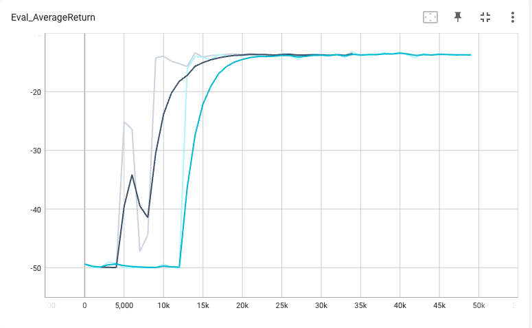
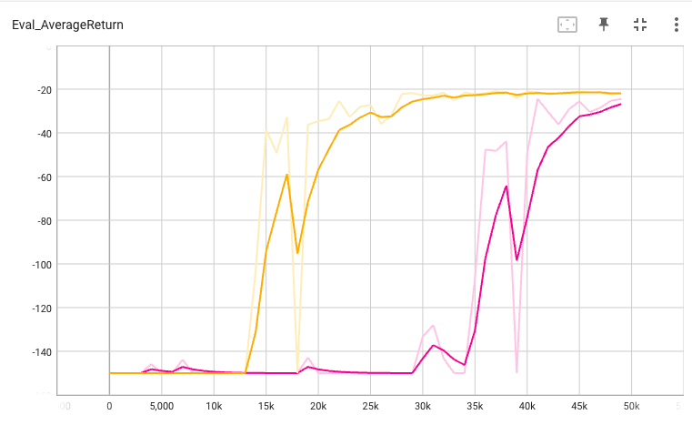
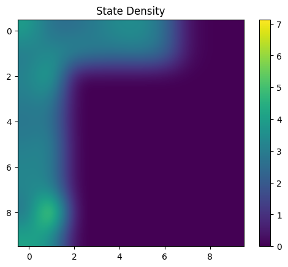
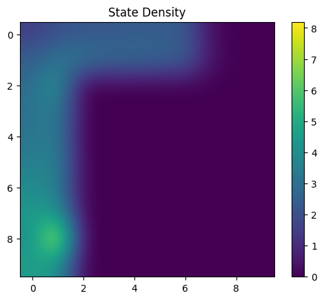
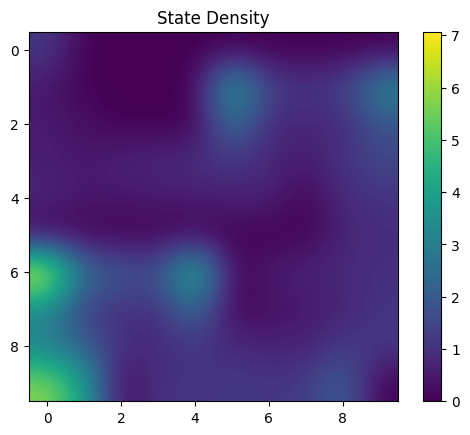
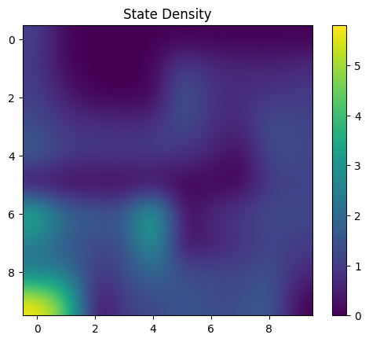
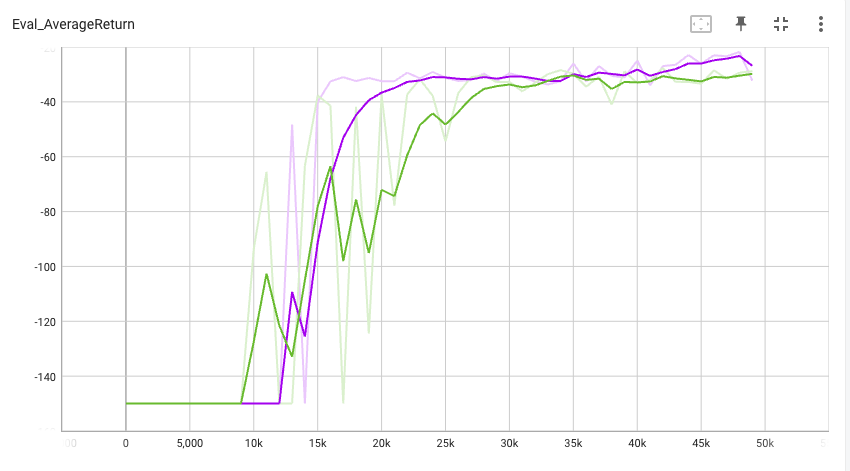
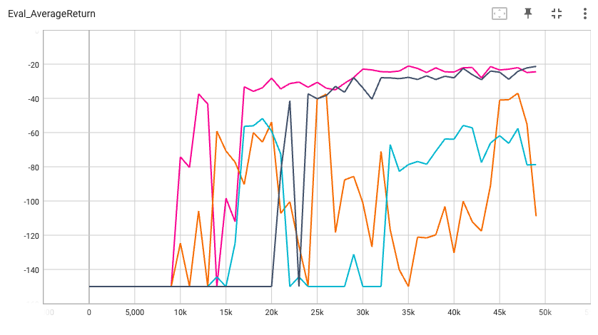
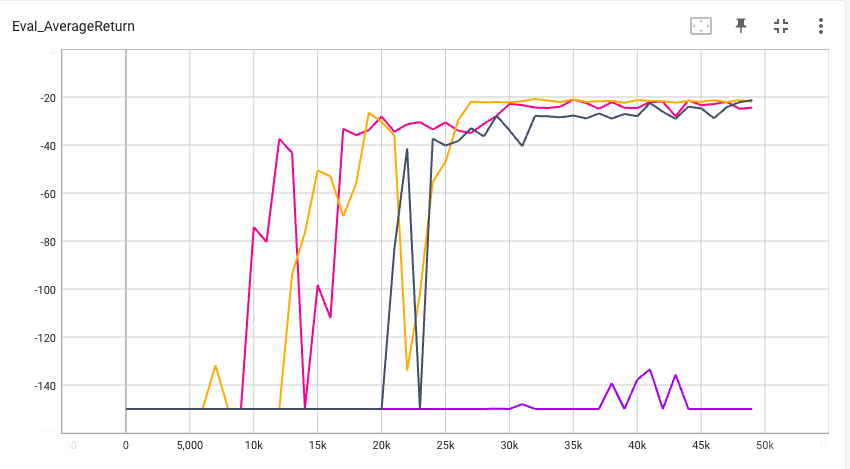

# CS 285 HW5 Report 

## Problem \#1: “Unsupervised” RND and exploration performance

### Part \#1

#### Subpart \#1

The plot below shows a comparison of the RND algorithm (black line) versus epsilon greedy exploration (blue line) on the _PointMassEasy-v0_ environment. We see the RND converges faster, but makes a few jumps in between. The random method makes a very large jump.

This plot shows the RND (pink line) veruss epsilon greedy random (yellow line) on the _PointMassMedium-v0_ environment. What's most interesting here is that the random method outperforms the RND method in that it converges faster, whereas it takes many more iterations for the RND to catch up.

The state density plots are below in run order: 

#### Subpart \#2

**STILL NEED TO DO BOI**

### Part \#2: Offline learning on exploration data

#### Subpart \#1: 
**Answer the written part abt state q value stuff**

The plot below shows the vanilla DQN (purple line) vs vanilla CQL (green line). 

#### Subpart \#2: 

The plot below compares the performance of DQN 5k steps (light blue), DQN 15k steps (pink), CQL 5k steps (orange), CQL 15k steps (dark blue). In both cases, having more steps definitely improves performance, as we see the pink line and dark blue line converge much faster and are more stable than their 5k counterparts. The best run was the DQN15k, followed by CQL15k. The other two runs are both quite bad and volatile, but the DQN5k is slightly better in my opinion.

#### Subpart \#3:
I followed the exact numbers provided, comparing $\alpha = 0.02$ (yellow line) and $\alpha = 0.5$ (purple line). Without a doubt, having the smaller $\alpha$ value improved the performance greatly. We see the purple line does barely any learning at all, whereas the yellow line converges quite nicely. You can also see the comparison between the best runs earlier (DQN15k, $\alpha=0$, pink line) and (CQL15k, $\alpha=0.1$, dark blue). In this comparison, I still argue that $\alpha=0$ is best, now followed by $\alpha=0.02$. It follows that on this environment, reducing $\alpha$ tends to yield better performance. That being said, I didn't do check a huge number of values due to time constraints and might be finding local optima.

_Why or why not do you expect one algorithm to be better than the other?
Do the results align with this expectation? If not, why?_

Also add a bit about trying another value in between n

### Part \#3: “Supervised” exploration with mixed reward bonuses

### Part \#4: Offline Learning with AWAC: 

make sure to do a run outside of the givne ranges to see how it does and talk about what we expected it to do for each of tehse

### Part \#5: Offline Learning with IQL

